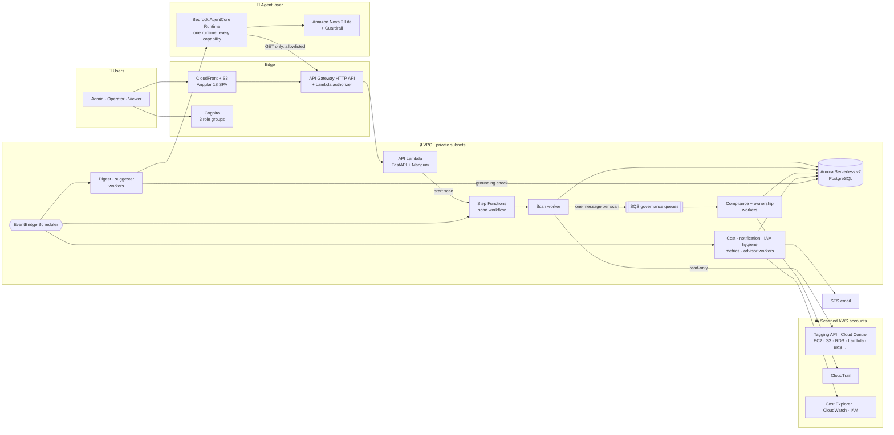
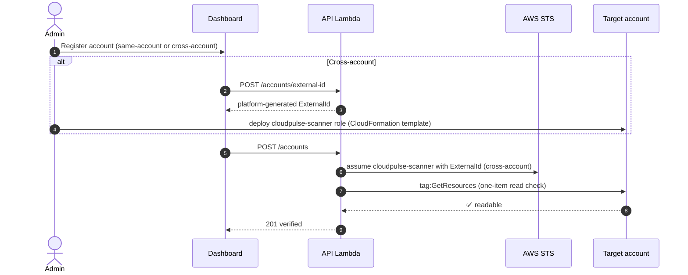
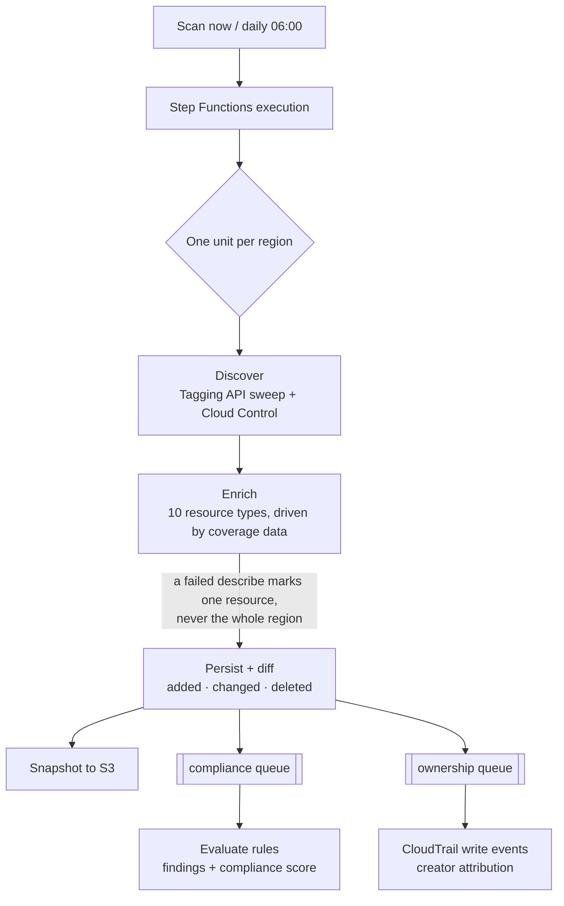
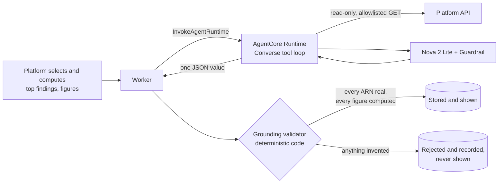
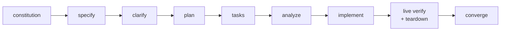

<div align="center">

# ☁️ CloudPulse AI

### AWS-native cloud governance with an agentic edge

**Discover everything in your AWS accounts · Enforce tagging and ownership · See cost and waste · Get grounded AI insights, all without storing a single credential.**

[](https://github.com/SumanKanrar-IEM/CloudPulse-AI/actions/workflows/ci.yml)


[Overview](#-what-is-cloudpulse-ai) ·
[Architecture](#-architecture) ·
[How it works](#-how-it-works) ·
[Getting started](#-getting-started) ·
[Provisioning](#-provisioning-and-deployment) ·
[Teardown](#-teardown-and-cost-hygiene) ·
[Project status](#-project-status)

</div>

---

## 📖 Table of contents

1. [What is CloudPulse AI?](#-what-is-cloudpulse-ai)
2. [Capabilities](#-capabilities)
3. [Design principles](#-design-principles)
4. [Architecture](#-architecture)
5. [How it works](#-how-it-works)
6. [Roles and security model](#-roles-and-security-model)
7. [Tech stack](#-tech-stack)
8. [Repository layout](#-repository-layout)
9. [Project map: every folder and file](#-project-map)
10. [Getting started](#-getting-started)
11. [Running the backend](#-running-the-backend)
12. [Running the frontend](#-running-the-frontend)
13. [Provisioning and deployment](#-provisioning-and-deployment)
14. [Teardown and cost hygiene](#-teardown-and-cost-hygiene)
15. [Quality gates and CI/CD](#-quality-gates-and-cicd)
16. [How this project was built](#-how-this-project-was-built)
17. [Project status](#-project-status)
18. [Further reading](#-further-reading)

---

## 🌐 What is CloudPulse AI?

Most teams can't answer three basic questions about their AWS estate: **what exists, who owns it, and is it compliant?** Inventory sits in five consoles, tags are inconsistent, and nobody reads five dashboards every morning.

CloudPulse AI answers all three from one place:

- 🔍 **Whole-account discovery.** Every resource in every connected account and region, tagged or not, found through generic AWS surfaces rather than a hand-maintained list of services.
- 🏷️ **Tag compliance as data.** Rules are rows in a database, not code. Every violation becomes a tracked **finding** with a lifecycle, and every account gets a **compliance score**.
- 👤 **Ownership.** Each resource is traced to the human who created it, using CloudTrail, with fallbacks when the creator is unknown.
- 📊 **A governance dashboard.** Overview, inventory explorer, findings workbench and scan operations, with role-aware controls.
- 💸 **Cost and utilization.** Daily spend from Cost Explorer, budgets with overrun findings, idle-resource detection, IAM hygiene, and **owner email** on a day-0/2/4 cadence.
- 🤖 **Agentic insights.** A daily plain-language **digest**, a **remediation suggestion** for each finding, coverage-gap proposals, forecasts and rightsizing. Every AI output is **validated against platform data before it is shown**: no invented ARNs, no invented numbers.

> [!IMPORTANT]
> CloudPulse AI **reads** your accounts and never changes them. Scanning is read-only, agents cannot execute changes or hold credentials, and there are **no stored access keys anywhere**. Accounts connect through IAM roles, and CI/CD authenticates through GitHub OIDC.

---

## ✨ Capabilities

The product is delivered as six feature specs, each fully specified, planned, implemented and verified in dependency order:

| # | Spec | What it delivers | Highlights |
|:-:|------|------------------|-----------|
| 001 | [**Platform foundation**](specs/001-platform-foundation/spec.md) | Terraform for two environments, CI/CD, identity, API skeleton, data model | 15 required CI checks, OIDC-only deploys, error envelope, correlation IDs, audit log |
| 002 | [**Account onboarding and discovery**](specs/002-account-onboarding-and-discovery/spec.md) | Connect accounts (same-account or cross-account with ExternalId); whole-account scans | Tagging API sweep plus Cloud Control, targeted enrichment for 10 resource types, coverage as data |
| 003 | [**Tag compliance and ownership**](specs/003-tag-compliance-and-ownership/spec.md) | Rules, SDA registry, findings, compliance score, ownership attribution | Findings lifecycle, CloudTrail creator attribution, owner-identity fallback chain |
| 004 | [**Governance dashboard**](specs/004-governance-dashboard/spec.md) | Angular dashboard: overview, inventory, findings workbench, scan operations | Server-side paging, role-aware UI, axe-checked accessibility |
| 005 | [**Cost, utilization and notifications**](specs/005-cost-and-utilization/spec.md) | Spend ingestion, budgets, utilization, IAM hygiene, owner email | Day-0/2/4 reminder cadence with escalation, flag-only IAM analysis |
| 006 | [**Agentic insights**](specs/006-agentic-insights/spec.md) | Digest, suggester, coverage advisor, metrics, forecasts, rightsizing | Bedrock AgentCore + Amazon Nova 2 Lite, deterministic grounding validator, per-run cost cap |

Every requirement carries a tier. **P1** is the demo-critical path; **P2** is stretch that never blocks P1.

---

## 🧭 Design principles

The project is governed by a [**constitution**](.specify/memory/constitution.md) (v3.0.0). Each principle below is enforced by code or CI, not just written down:

| Principle | In practice | Enforced by |
|---|---|---|
| **I · Spec-first delivery** | Every change traces to a task, every task to a plan, every plan to a spec | `pr-task-reference` CI gate |
| **II · AWS-native runtime, GitHub-native delivery** | All runtime on AWS managed services; GenAI exclusively on Amazon Bedrock | `dependency-allowlist` CI gate |
| **III · Zero stored credentials** | IAM roles only, ExternalId for cross-account, GitHub OIDC for CI/CD | `secret-scan` (gitleaks), IAM design |
| **IV · Deterministic core, agentic edge** | Discovery, validation, scoring and cost are deterministic; agents explain and propose, never execute | Grounding validator, read-only agent API |
| **V · Contract-first modularity** | OpenAPI is the binding contract; provider SDKs stay in `connectors/`; rules and coverage are data | `contract-compat`, `client-drift`, `connector-boundary` gates |
| **VI · Test and quality gates** | Lint, types, unit, integration, e2e and evals on every PR | 15 required status checks |
| **VII · Solo trunk-based delivery** | One long-lived branch (`pods/pod73`), short-lived `pods/pod73-*` branches | Branch protection |
| **VIII · Honest prioritization** | P1 is frozen; P2 never blocks P1 | Task tiers |

---

## 🏗️ Architecture



<details>
<summary><b>📦 AWS services and why each one is there</b></summary>

| Service | Role in CloudPulse AI |
|---|---|
| **Lambda** (Python 3.12, arm64) | API, authorizer, Cognito pre-token hook, migrations, and 10 workers |
| **API Gateway HTTP API** | Public API with a `REQUEST` Lambda authorizer that turns a Cognito JWT into a role |
| **Cognito** | Sign-in and three groups: `cloudpulse-admins`, `cloudpulse-operators`, `cloudpulse-viewers` |
| **Aurora Serverless v2** (PostgreSQL) | Governance store; its password is managed and rotated by RDS, never stored |
| **Step Functions** (Standard) | Scan workflow: one unit of work per account and region |
| **SQS** + DLQs | Fan-out from a finished scan to the compliance and ownership workers |
| **EventBridge Scheduler** | Daily and weekly triggers for scans and workers |
| **S3** | Raw scan snapshots (versioned), the SPA origin, agent artifacts |
| **CloudFront** (OAC) | Serves the SPA |
| **Secrets Manager** | Per-account ExternalIds, the database credential, the agent's client secret |
| **Bedrock AgentCore Runtime** | Hosts the agent from a code zip, with no container |
| **Amazon Nova 2 Lite** | The model, via the `global.amazon.nova-2-lite-v1:0` inference profile |
| **Bedrock Guardrails** | Applied on every model call |
| **SES** | Owner-notification email |
| **CloudTrail · Cost Explorer · CloudWatch · IAM** | Read-only data sources for ownership, spend, metrics and hygiene |
| **VPC endpoints / optional NAT** | S3 and Secrets Manager endpoints always; a NAT gateway only for live-verification windows (`enable_egress`) |

</details>

---

## ⚙️ How it works

### 1 · Onboarding an account



Two connection modes:

- **Same-account.** The platform scans the account it runs in, with its own read-only roles.
- **Cross-account.** The target deploys [`cross_account_template.yaml`](infra/modules/scan/cross_account_template.yaml). It creates a read-only `cloudpulse-scanner` role that can be assumed only with the platform-issued ExternalId.

If a later scan can't assume the role, the account turns `failed` with an actionable reason.

### 2 · The scan pipeline



- **Coverage is data.** Which types get enriched, and with which fields, lives in [`coverage_definitions.json`](backend/app/scan/coverage_definitions.json). Adding a type needs no code change.
- **Diffing** records added, changed and deleted resources per scan. A resource missing from a partial scan is never deleted by mistake.
- **Governance runs once per finished scan**, over SQS, with dead-letter queues for anything that repeatedly fails.

### 3 · The daily rhythm (UTC)

| Time | Job | What it does |
|:---:|---|---|
| 06:00 | 🔍 Scan | Every verified account, every configured region |
| 07:00 | 💸 Cost ingestion | Yesterday's spend from Cost Explorer, then budget checks |
| 07:30 | 📈 Metrics | CloudWatch utilization for rightsizing and forecasts |
| 08:00 | ✉️ Notifications | Day-0 owner email, day-2 and day-4 reminders, escalation flag |
| 08:00 | 🧩 Coverage advisor | Detects coverage gaps deterministically, with no model call |
| 09:00 | 📰 Insight digest | One grounded daily summary |
| 10:00 | 🛠️ Suggester | One grounded suggestion per open finding, under a token cap |
| Sun 09:00 | 🔐 IAM hygiene | Flags unused principals and keys (flag-only, never deletes) |

### 4 · AI insights with a grounding gate



- **The platform decides and the agent explains.** Ranking, figures and forecasts are computed deterministically. The model only writes prose around them.
- **The grounding validator is code, not a second model call.** A second model could hallucinate too, which would defeat its purpose.
- **Every run has a token budget.** Item-wise outputs such as suggestions keep every validated item when a run is cut short. Whole-artifact outputs such as the digest discard partial output, and the run is marked `truncated`.
- **Prompts and definitions are versioned by content hash** on every run row, and evaluated in CI against recorded fixtures (`agent-evals`).

### 5 · Findings lifecycle and notifications

A rule violation opens a **finding**, which is either resolved automatically by a later scan or acknowledged by an operator. Its owner gets an email on **day 0**, reminders on **day 2** and **day 4**, and then an escalation flag. Budget overruns become findings in the same workbench.

---

## 🔐 Roles and security model

| Capability | 👑 Admin | 🛠️ Operator | 👀 Viewer |
|---|:-:|:-:|:-:|
| View dashboards, inventory, findings, cost, insights | ✅ | ✅ | ✅ |
| Trigger an on-demand scan | ✅ | ✅ | ❌ |
| Acknowledge a finding | ✅ | ✅ | ❌ |
| Register, deactivate and reactivate accounts, edit regions | ✅ | ❌ | ❌ |
| Manage rules, SDAs and budgets; decide coverage proposals | ✅ | ❌ | ❌ |

- **Roles come from Cognito group claims on every request** and are never stored. A user in zero groups, or in two, is refused rather than guessed.
- **Every query is scoped to a tenant**, and a missing scope fails closed.
- **The audit log is append-only and permanent.**
- **Agents** reach data only through the platform API, as a read-only, tenant-scoped principal. They are refused on every state-changing call.
- **Scanning is read-only.** Every scanner permission is Describe, Get or List, and a unit test fails the build if that ever changes.

---

## 🧰 Tech stack

<table>
<tr><td><b>Backend</b></td><td>Python 3.12 · FastAPI 0.115 + Mangum · Pydantic v2 · SQLAlchemy 2.0 · Alembic · psycopg 3 · AWS Lambda Powertools</td></tr>
<tr><td><b>Frontend</b></td><td>Angular 18 (standalone components, signals) · Angular Material · TypeScript 5.5 · client generated from OpenAPI · Playwright + axe-core</td></tr>
<tr><td><b>Data</b></td><td>Aurora Serverless v2 PostgreSQL (0.5–2 ACU in dev) · S3</td></tr>
<tr><td><b>AI</b></td><td>Amazon Bedrock AgentCore Runtime · Amazon Nova 2 Lite · Bedrock Guardrails</td></tr>
<tr><td><b>Infrastructure</b></td><td>Terraform 1.15.8 · AWS provider ~> 6.0 · 11 modules, 2 environments</td></tr>
<tr><td><b>Delivery</b></td><td>GitHub Actions · OIDC federation · GitHub Spec Kit · Claude Code</td></tr>
<tr><td><b>Testing</b></td><td>pytest · moto · Testcontainers (PostgreSQL) · LocalStack · Playwright · agent evals</td></tr>
</table>

---

## 🗂️ Repository layout

```text
.
├── backend/                  # Python API, workers, governance logic
│   ├── app/api/              #   FastAPI app, routers, error envelope, middleware
│   ├── app/core/             #   config, tenant-scoped DB, security, audit, logging
│   ├── app/governance/       #   rules, scoring, ownership, spend, budgets, grounding, AI pipelines
│   ├── app/scan/             #   discovery, enrichment, orchestration, coverage as data
│   ├── app/models/           #   SQLAlchemy models
│   ├── connectors/           #   the only place AWS SDK code lives (aws.py)
│   ├── handlers/             #   one Lambda entry point per function (API, authorizer, 10 workers …)
│   ├── migrations/           #   Alembic revisions
│   ├── tests/                #   unit (moto) and integration (Testcontainers, LocalStack)
│   └── openapi.generated.yaml  # the binding API contract
├── frontend/                 # Angular 18 SPA
│   ├── src/app/features/     #   overview, inventory, findings, scans, accounts, SDAs, cost …
│   ├── src/app/api/          #   generated client (never hand-edited)
│   └── e2e/                  #   Playwright journeys, per role
├── agents/                   # AgentCore runtime, definitions, prompts, tool allowlists, evals
├── infra/
│   ├── bootstrap/            #   state backend + GitHub OIDC trust (the one manual step)
│   ├── modules/              #   network, database, identity, api, frontend, storage, scan,
│   │                         #   governance, cost, agents, observability
│   └── envs/{dev,prod}/      #   root modules
├── ops/                      # teardown.sh, CI gate scripts, runbooks, ERD
├── specs/00{1..6}-*/         # spec · plan · research · data model · contracts · quickstart · tasks
├── .specify/memory/constitution.md
├── .github/workflows/        # ci.yml, deploy-dev.yml, deploy-prod.yml
├── AI_WORKFLOW_JOURNAL.md    # how the project was actually built, phase by phase
├── SPECKIT_PLAYBOOK.md       # the delivery playbook
└── CONTRIBUTING.md
```

Each top-level area has its own README with deeper detail: [backend](backend/README.md) · [frontend](frontend/README.md) · [infra](infra/README.md) · [agents](agents/README.md).

---

## 🗃️ Project map

A complete guide to what lives where: first every folder and subfolder, then each file, grouped by area.

### Folders and subfolders

| Folder | What it is | Relevance |
|---|---|---|
| **`/`** (root) | Project-wide docs and config | Entry point: README, constitution-driven process docs, Makefile, lint and secret-scan config |
| `.github/` | GitHub configuration | Everything GitHub runs or reads |
| ├─ `.github/workflows/` | GitHub Actions | CI gate (`ci.yml`), the two deploy pipelines, and the five agentic workflows (sources plus compiled `.lock.yml` files) |
| ├─ `.github/aw/` | gh-aw metadata | Pinned action versions used by the compiled agentic workflows |
| └─ `.github/skills/` | Agent skills | Spec Kit commands and the gh-aw dispatcher, for agents working inside GitHub |
| `.claude/skills/` | Claude Code skills | The `/speckit-*` commands Claude Code runs (specify, plan, tasks, implement, analyze, converge, and so on) |
| `.specify/` | GitHub Spec Kit | The spec-driven workflow engine |
| ├─ `.specify/memory/` | Project memory | **`constitution.md`**, the non-negotiable principles every spec and PR is checked against |
| ├─ `.specify/templates/` | Spec Kit templates | Blank spec, plan, tasks, checklist and constitution templates |
| ├─ `.specify/scripts/{bash,python}/` | Spec Kit helpers | Locate the active feature, create feature folders, check prerequisites |
| ├─ `.specify/integrations/` | Integration manifests | Which AI agents (Claude, Copilot) Spec Kit is wired to |
| └─ `.specify/workflows/` | Workflow registry | The `speckit` lifecycle definition |
| **`backend/`** | Python backend | All server-side code: API, workers, governance logic, AWS connector, migrations, tests |
| ├─ `backend/app/` | Application package | Everything except Lambda entry points and SDK code |
| │ ├─ `app/api/` | HTTP layer | FastAPI app, error envelope, correlation middleware |
| │ │ └─ `app/api/routers/` | Endpoints | One router per resource area: accounts, findings, spend, insights … |
| │ ├─ `app/core/` | Cross-cutting core | Settings, tenant-scoped DB sessions, auth, audit log, logging, user resolution |
| │ ├─ `app/governance/` | Business logic | Rules, scoring, ownership, spend, budgets, notifications, grounding and every AI pipeline, all deterministic |
| │ ├─ `app/models/` | Data model | SQLAlchemy models and enums for every table |
| │ ├─ `app/scan/` | Scan engine | Discovery, enrichment, orchestration, role verification, coverage data |
| │ └─ `app/workers/` | Reserved | Unused placeholder; workers live in `handlers/` |
| ├─ `backend/connectors/` | Provider boundary | The **only** place AWS SDK code lives |
| ├─ `backend/handlers/` | Lambda entry points | One file per deployed Lambda function |
| ├─ `backend/migrations/` | Alembic | Database schema history |
| │ └─ `migrations/versions/` | Revisions | 17 ordered, additive migrations (0001–0017) |
| └─ `backend/tests/` | Test suites | `unit/` (57 test files: logic, moto, infra invariants) and `integration/` (53 test files: Testcontainers PostgreSQL, LocalStack) |
| **`frontend/`** | Angular 18 SPA | The dashboard users sign into |
| ├─ `frontend/src/app/core/` | App core | Auth (Cognito PKCE), guards, HTTP interceptors, runtime config |
| ├─ `frontend/src/app/shared/` | Shell | App layout and primary navigation |
| ├─ `frontend/src/app/features/` | Screens | One folder per feature area (see the file guide) |
| ├─ `frontend/src/app/api/` | **Generated** client | Typed services and models generated from `openapi.generated.yaml`; never hand-edited |
| └─ `frontend/e2e/` | Browser tests | Playwright journeys per role, with axe accessibility checks |
| **`agents/`** | AI agent layer | What runs inside Bedrock AgentCore |
| ├─ `agents/runtime/` | Agent runtime | The single agent AgentCore hosts (Converse tool loop) |
| ├─ `agents/definitions/` | Capability definitions | Model, inference settings, loop bound and tool schema per capability |
| ├─ `agents/prompts/` | Prompts | One versioned, content-hashed prompt per capability |
| ├─ `agents/action-groups/` | Tools | Read-only platform-API client and per-capability allowlists |
| └─ `agents/evals/` | Evaluations | Recorded-output cases replayed through the grounding validator in CI |
| **`infra/`** | Terraform | All AWS infrastructure as code |
| ├─ `infra/bootstrap/` | One-time setup | State bucket, lock table, GitHub OIDC trust, deploy-role policy |
| ├─ `infra/modules/` | Reusable modules | 11 modules shared by both environments (listed in the file guide) |
| ├─ `infra/envs/dev/` · `infra/envs/prod/` | Root modules | Wire the modules together per environment, with each environment's variables |
| └─ `infra/tests/` | Infra tests | Shell checks run against a deployed environment |
| **`ops/`** | Operations | Scripts, runbooks and tooling around the system |
| ├─ `ops/scripts/` | CI gate scripts | The architecture and infrastructure checks CI runs |
| ├─ `ops/runbooks/` | Runbooks | Provisioning and API-contract change procedures |
| ├─ `ops/erd/` | Entity diagram | The Mermaid ERD, kept in sync with the models by CI |
| ├─ `ops/ci-fixtures/` | Gate fixtures | One deliberately broken file per CI gate, proving each gate fails when it should |
| └─ `ops/spikes/` | Spikes | Throwaway experiments (e.g. the AgentCore feasibility spike) kept as evidence |
| **`specs/`** | Feature specs | One folder per spec, 001–006 |
| └─ `specs/00N-*/` | One feature | `spec.md`, `plan.md`, `research.md`, `data-model.md`, `quickstart.md`, `tasks.md`, plus `contracts/` (design-time OpenAPI) and `checklists/` (requirement-quality checks) |
| **`docs/`** | Deliverables | Architecture deck, capstone overview, engineering guide, plan and tech stack, backlog |

### Files, by area

<details>
<summary><b>📄 Root files</b></summary>

| File | Relevance |
|---|---|
| `README.md` | This document |
| `CONTRIBUTING.md` | The PR checklist distilled from the constitution; the rules the automated reviewer applies |
| `AI_WORKFLOW_JOURNAL.md` | Phase-by-phase record of how the project was built: decisions, deviations, live findings |
| `SPECKIT_PLAYBOOK.md` | Delivery playbook: command inputs, execution order, hard-won lessons, teardown sweep |
| `Makefile` | `make check` and friends: the local mirror of CI |
| `CODEOWNERS` | Review ownership |
| `.editorconfig` | Editor formatting defaults |
| `.gitattributes` | Marks the compiled `.lock.yml` workflows as generated |
| `.gitignore` | Ignores build output, state files, secrets and local Claude Code state |
| `.gitleaks.toml` | Secret-scan config, with a narrow allowlist for the credential-*shaped* test fixtures |
| `.terraform-version` | Pins Terraform 1.15.8 for local use and CI alike |
| `.terraformignore` | Keeps local artifacts out of Terraform uploads |

</details>

<details>
<summary><b>⚙️ <code>.github/workflows/</code></b></summary>

| File | Relevance |
|---|---|
| `ci.yml` | The PR gate: 15 required checks (lint, types, unit, integration, frontend + e2e, Terraform ×2, secret scan, contract, client drift, dependency allowlist, connector boundary, ERD, task reference, agent evals) |
| `deploy-dev.yml` | Builds the Lambda, agent and SPA packages; applies Terraform; runs migrations; injects runtime config; smoke-tests. Inputs `enable_egress` and `enable_agent_endpoints` |
| `deploy-prod.yml` | Manual-only prod deploy: read-only plan first, approval, trunk-only commits |
| `contribution-guidelines-checker.md` / `.lock.yml` | Constitution-aware PR reviewer (gh-aw; disabled) |
| `issue-triage.md` / `.lock.yml` | Labels issues P1/P2 and `spec/00N` (gh-aw; disabled) |
| `ci-doctor.md` / `.lock.yml` | Investigates CI failures (gh-aw; disabled) |
| `duplicate-code-detector.md` / `.lock.yml` | Daily duplicate-code report (gh-aw; disabled) |
| `daily-repo-status.md` / `.lock.yml` | Journal drafter: proposes `AI_WORKFLOW_JOURNAL.md` entries as issues (gh-aw; disabled) |
| `agentics-maintenance.yml` | gh-aw housekeeping job (disabled) |

</details>

<details>
<summary><b>🐍 <code>backend/</code>, top level and API</b></summary>

| File | Relevance |
|---|---|
| `pyproject.toml` | Dependencies, ruff, mypy and pytest configuration |
| `build-requirements.txt` | Runtime dependency pins for the Lambda package |
| `alembic.ini` · `migrations/env.py` | Alembic configuration and migration environment |
| `openapi.generated.yaml` | **The binding API contract**, generated from the Pydantic models |
| `app/api/main.py` | Builds the FastAPI app: routers, middleware, exception handlers, OpenAPI document |
| `app/api/errors.py` | The uniform error envelope every endpoint returns |
| `app/api/middleware.py` | Correlation IDs and per-request structured logging |
| `routers/accounts.py` | Register, list, edit regions, deactivate and reactivate accounts; ExternalId; trigger scans; scan history |
| `routers/resources.py` | Inventory: paged, filtered list and resource detail |
| `routers/findings.py` | Findings list, acknowledge, AI and admin suggestions, notification history |
| `routers/compliance.py` | Compliance scores per account and per SDA |
| `routers/rules.py` | Tagging rules (rules as data) |
| `routers/sdas.py` | SDA registry and unmatched ("No SDA") resources |
| `routers/ownership.py` | Resource owners, owner-identity patterns and overrides |
| `routers/spend.py` · `budgets.py` · `budget_overruns.py` | Spend, budgets and overrun findings |
| `routers/utilization.py` · `iam_hygiene.py` | Idle-resource utilization and IAM hygiene flags |
| `routers/insights.py` | AI digest, agent run history, grounding rejections |
| `routers/coverage_proposals.py` | Coverage proposals (admin decides) and advisory gaps (read-only) |
| `routers/forecasts.py` · `rightsizing.py` | Spend forecasts with backtest error; rightsizing recommendations |
| `routers/me.py` · `health.py` | Current user and role; health check with database status |

</details>

<details>
<summary><b>🧠 <code>backend/app/core/</code>, <code>app/models/</code>, <code>app/scan/</code></b></summary>

| File | Relevance |
|---|---|
| `core/config.py` | Settings from the environment; rejects literal credentials (zero stored credentials) |
| `core/db.py` | Engine and **fail-closed tenant-scoped sessions** |
| `core/security.py` | Principal, role from group claims (0 or 2+ groups refused), role-gate aliases |
| `core/audit.py` | Append-only, permanent audit log writer |
| `core/logging.py` | Structured JSON logging (Powertools) |
| `core/users.py` | Resolves the caller's `app_user` on first request |
| `core/agent_access.py` | The read-only, tenant-scoped principal agents act as |
| `core/deployments.py` | Records each deployment (called by the migrate Lambda) |
| `models/base.py` · `core.py` · `enums.py` | Declarative base, every table, every enum |
| `scan/discovery.py` | Whole-account discovery dispatch (no SDK code) |
| `scan/enrichment.py` | Per-type enrichment dispatch; a failed describe degrades one resource, never the region |
| `scan/orchestrator.py` | Step Functions lifecycle, diffing, deleted markers, governance fan-out, daily trigger, account status from the role check |
| `scan/verification.py` | Registration-time role verification, and the actionable failure reason |
| `scan/coverage.py` | Loads coverage definitions and merges accepted proposals |
| `scan/coverage_definitions.json` | **Coverage as data**: which types are enriched, with which fields |
| `scan/enricher_candidates.json` | Existing enrichers the advisor may propose for unmapped types |

</details>

<details>
<summary><b>📐 <code>backend/app/governance/</code>, the business logic</b></summary>

| File | Relevance |
|---|---|
| `validation.py` | Evaluates tag rules; opens, resolves and suppresses findings |
| `scoring.py` | Compliance score per account and SDA |
| `sda_matching.py` | Matches resources to service delivery areas (SDAs) |
| `ownership.py` | Direct-creator attribution from CloudTrail, with a fallback chain |
| `identity_resolution.py` | Resolves an audit identity to a contact email |
| `scan_deltas.py` | Added, changed and removed counts per scan, computed at query time |
| `suggestions.py` | A finding's suggestion: fetch, admin seed, agent write |
| `spend.py` | Cost Explorer ingestion, SDA attribution, gap rows |
| `budgets.py` | Auto-created budgets, threshold crossing, overrun findings |
| `notifications.py` | Day-0 email, day-2 and day-4 reminders, escalation flag |
| `utilization.py` | Active vs idle classification |
| `iam_hygiene.py` | Unused-principal judgement (flag only) |
| `grounding.py` | **The deterministic validator** every AI output passes before display |
| `agent_runs.py` | Token cap, run outcomes (`succeeded`, `truncated`, `failed`), item-wise vs whole-artifact rules |
| `definition_hash.py` | Content hash of the prompt and definition behind every run |
| `digest.py` | Digest pipeline: platform selects and computes, agent explains, validator gates |
| `suggester.py` | Suggester pipeline: one grounded suggestion per open finding, under the cap |
| `coverage_advisor.py` · `advisor.py` | Gap detection: proposable vs advisory are separate types |
| `metrics.py` | CloudWatch queries as data; unavailable is never zero |
| `forecasting.py` | Least-squares forecasts in `Decimal`, backtested by hold-out |
| `rightsizing.py` · `rightsizing_classes.json` | Low-and-steady CPU rightsizing; instance classes and prices as data |

</details>

<details>
<summary><b>🔌 <code>backend/connectors/</code> and <code>backend/handlers/</code></b></summary>

| File | Relevance |
|---|---|
| `connectors/base.py` | Provider-agnostic `Connector` protocol and the normalized resource model |
| `connectors/aws.py` | **All AWS SDK code**: role sessions, verification, discovery, 10 enrichers, CloudTrail sweeps, Cost Explorer, CloudWatch, IAM, ExternalId secrets, AgentCore invocation |
| `handlers/api_handler.py` | API Lambda (FastAPI via Mangum) |
| `handlers/authorizer_handler.py` | API Gateway authorizer: verifies the JWT and derives the role |
| `handlers/pre_token_handler.py` | Cognito pre-token-generation hook |
| `handlers/migrate_handler.py` | Runs Alembic migrations and records deployments from inside the VPC |
| `handlers/scan_worker_handler.py` | One scan unit (account × region): discover, enrich, persist, snapshot, mark failed roles |
| `handlers/compliance_validation_worker_handler.py` | SQS: evaluates rules after each scan |
| `handlers/ownership_attribution_worker_handler.py` | SQS: CloudTrail ownership after each scan |
| `handlers/cost_ingestion_worker_handler.py` | Daily spend plus budget checks |
| `handlers/notification_worker_handler.py` | Daily owner emails, reminders, escalation |
| `handlers/iam_hygiene_worker_handler.py` | Weekly IAM hygiene |
| `handlers/metrics_collector_handler.py` | Daily CloudWatch metrics |
| `handlers/advisor_worker_handler.py` | Daily coverage-gap detection (no model call) |
| `handlers/digest_worker_handler.py` | Daily AI digest |
| `handlers/suggester_worker_handler.py` | Daily AI suggestions |

</details>

<details>
<summary><b>🗄️ <code>backend/migrations/versions/</code></b></summary>

| Revision | Introduces |
|---|---|
| `0001`–`0004` | Extensions and enums, tenant and user, audit event, deployment (spec 001) |
| `0005`–`0008` | The governance schema's base tables: accounts and resources, rules and findings, SDAs and ownership, scans (spec 001) |
| `0009` | Resource lifecycle and enrichment detail (spec 002) |
| `0010` | Resource–SDA link, tenant identity pattern, the five seeded tag rules (spec 003) |
| `0011` | Finding acknowledgment and suggestions (spec 004) |
| `0012`–`0014` | Cost, utilization, notifications and their fixes (spec 005) |
| `0015`–`0016` | Agent runs, digests, grounding rejections, proposals, advisory gaps, metrics (spec 006) |
| `0017` | Account failure reason (spec 002 T062) |

</details>

<details>
<summary><b>🅰️ <code>frontend/</code></b></summary>

| File | Relevance |
|---|---|
| `package.json` · `package-lock.json` | Dependencies and scripts (`start`, `build`, `lint`, `e2e`, `generate:api`) |
| `angular.json` · `tsconfig.json` | Angular workspace and TypeScript configuration |
| `.eslintrc.json` · `.eslintignore` | Lint rules, including template accessibility rules |
| `openapitools.json` | OpenAPI generator configuration for the typed client |
| `playwright.config.ts` | E2E config: local dev server, or `E2E_BASE_URL` for a deployed site |
| `src/index.html` · `main.ts` · `styles.scss` | Host page (runtime config is injected here), bootstrap, global styles and the focus indicator |
| `src/app/app.component.ts` · `app.config.ts` | Root component; routes, guards and providers |
| `core/auth.service.ts` · `pkce.ts` · `sign-in.component.ts` · `auth.callback.component.ts` | Cognito sign-in with Authorization Code + PKCE |
| `core/auth.guard.ts` | Route and role guards (usability only; the API enforces) |
| `core/auth.interceptor.ts` · `correlation.interceptor.ts` | Attaches the token and a correlation ID to every call |
| `core/api-config.ts` | Reads `window.__CLOUDPULSE_CONFIG__` (API URL, Cognito, e2e mock role) |
| `shared/shell.component.ts` | Layout, skip link, primary navigation, sign-out |
| `features/overview/` | Compliance overview and the AI digest |
| `features/inventory/` | Inventory explorer and resource detail |
| `features/findings/` | Findings workbench: acknowledge, suggestions, budget overruns |
| `features/scans/` | Scan operations: trigger, history, deltas |
| `features/accounts/` | Accounts list, registration form, failure reasons |
| `features/sdas/` | SDA list, create form, "No SDA" triage |
| `features/cost/` | Cost dashboard |
| `features/utilization/` · `iam-hygiene/` | Idle resources; IAM hygiene flags |
| `features/insights/` | Rightsizing recommendations |
| `features/forecasts/` | Spend forecasts with backtest error |
| `features/coverage-proposals/` | Coverage proposals and advisory gaps |
| `e2e/*.spec.ts` | 8 Playwright suites: auth, shell, compliance overview, inventory, findings, scan operations, SDAs, and the full per-role dashboard smoke |

Each feature folder pairs a `*.component.ts` (the screen) with a `*.service.ts` (state and API calls).

</details>

<details>
<summary><b>🤖 <code>agents/</code></b></summary>

| File | Relevance |
|---|---|
| `runtime/main.py` | The agent AgentCore hosts: `/ping` and `/invocations`, capability loading, the Converse tool loop with guardrail and iteration bound, JSON extraction |
| `definitions/{digest,suggester,advisor,narrator}.json` | Per capability: model ID, inference settings, loop bound, tool schema |
| `prompts/{digest,suggester,advisor,narrator}.md` | Versioned prompts; their content hash is recorded on every run |
| `action-groups/_platform_api.py` | The only way an agent reads data: HTTPS, GET only, allowlisted paths, a token per call |
| `action-groups/*_tools.py` | Each capability's path allowlist |
| `evals/run_evals.py` · `evals/cases/*.json` | 16 recorded cases replayed through the real parsers and grounding validator in CI |

The narrator capability is built but its display is out of scope (spec 006 US7, descoped).

</details>

<details>
<summary><b>🏗️ <code>infra/</code></b></summary>

| Path | Relevance |
|---|---|
| `bootstrap/main.tf` · `oidc.tf` · `deploy_policy.tf` · `outputs.tf` | State bucket and lock table; GitHub OIDC provider; the deploy role's scoped policy |
| `envs/{dev,prod}/main.tf` | Composes every module for the environment |
| `envs/{dev,prod}/variables.tf` · `terraform.tfvars` | Environment inputs: Aurora ACU range, feature toggles, schedules |
| `envs/{dev,prod}/backend.tf` · `outputs.tf` | Remote-state config; outputs the deploy workflow injects into the SPA |
| `modules/network/` | VPC, private subnets, S3 and Secrets Manager endpoints, optional AgentCore endpoint, **optional NAT egress** |
| `modules/database/` | Aurora Serverless v2 PostgreSQL, RDS-managed credential, optional RDS Proxy |
| `modules/identity/` | Cognito user pool, three role groups, app client, hosted UI |
| `modules/api/` | HTTP API, authorizer, API, migrate and pre-token Lambdas, API role |
| `modules/frontend/` | S3 origin and CloudFront (OAC) |
| `modules/storage/` | Versioned scan-snapshot bucket (force-destroy in dev only) |
| `modules/scan/` | Scan worker, Step Functions workflow (`scan_workflow.asl.json`), daily schedule, **`cross_account_template.yaml`** (the scanner role targets deploy) |
| `modules/governance/` | Compliance and ownership SQS queues, DLQs, workers |
| `modules/cost/` | Cost-ingestion, notification and IAM-hygiene workers and their schedules |
| `modules/agents/` | AgentCore runtime, its role, guardrail, artifact bucket; digest, suggester, advisor and metrics workers and schedules |
| `modules/observability/` | Dashboards and alarms (P2, off by default) |
| `tests/*.sh` | Post-deploy checks: plan idempotency, authorizer error envelope, alarm wiring |

</details>

<details>
<summary><b>🛠️ <code>ops/</code></b></summary>

| File | Relevance |
|---|---|
| `teardown.sh` | Destroys an environment; **refuses prod before running anything** |
| `scripts/check_connector_boundary.py` | Fails if an AWS SDK import appears outside `connectors/` |
| `scripts/check_dependencies.py` | Fails if a non-AWS AI SDK enters a dependency manifest |
| `scripts/check_terraform_ascii.py` | Fails on non-ASCII Terraform values, which AWS rejects mid-apply |
| `scripts/check_stepfunctions_asl.py` | Validates the Step Functions definition's structure |
| `scripts/verify_boundaries.py` | Checks the architectural boundaries in the built system |
| `runbooks/provisioning.md` | Fresh account to working dev in under 60 minutes |
| `runbooks/contract-changes.md` | How to change the API contract without breaking it |
| `erd/schema.mmd` | Mermaid entity-relationship diagram (CI keeps it current) |
| `ci-fixtures/*.txt` | 11 deliberately broken inputs, one per gate, proving each gate fires |
| `spikes/agentcore/` | The AgentCore feasibility spike's scripts and results |

</details>

<details>
<summary><b>📐 <code>specs/00N-*/</code>, the same structure for every spec</b></summary>

| File | Relevance |
|---|---|
| `spec.md` | User stories, functional requirements (FR-###), success criteria (SC-###), clarifications |
| `plan.md` | Technical approach, structure, phases, constitution check |
| `research.md` | Decisions with alternatives and rationale (R-###), including ones reversed later |
| `data-model.md` | Tables, columns, constraints and state transitions the spec adds |
| `contracts/openapi.yaml` | Design-time API contract (the generated one in `backend/` is binding) |
| `quickstart.md` | Validation scenarios to prove the spec against a real environment |
| `tasks.md` | Every task (T###), with its outcome, including the convergence and live-found fixes |
| `checklists/*.md` | Requirement-quality checklists |

</details>


---

## 🚀 Getting started

### Prerequisites

| Tool | Version | Needed for |
|---|---|---|
| Python | 3.12 | Backend |
| Node.js | 20 | Frontend |
| Docker | any recent | Integration tests (Testcontainers, LocalStack) |
| Terraform | 1.15.8 (pinned in `.terraform-version`) | Infrastructure |
| AWS CLI v2 | with an SSO profile | Provisioning, operations |
| Java (JRE) | any recent | Regenerating the Angular API client only |

### Clone and install

```bash
git clone https://github.com/SumanKanrar-IEM/CloudPulse-AI.git && cd CloudPulse-AI
```

```bash
cd backend && python3.12 -m venv .venv && .venv/bin/pip install -e ".[dev]" && cd ..
```

```bash
cd frontend && npm ci && cd ..
```

### Run every local check

The same checks CI runs: lint, types, unit tests, the frontend build, Terraform validation, and the architecture gates.

```bash
make check
```

> [!NOTE]
> The backend runs **only on AWS Lambda**. There is no local API server, by design. Locally you verify it through its test suites; to use the running system, deploy it (see [Provisioning](#-provisioning-and-deployment)).

---

## 🐍 Running the backend

All commands run from `backend/`.

```bash
.venv/bin/ruff check . && .venv/bin/ruff format --check . && .venv/bin/mypy .
```

**Unit tests.** No AWS credentials are allowed, and AWS is mocked with moto.

```bash
.venv/bin/pytest tests/unit -m "not integration"
```

**Integration tests.** A real PostgreSQL runs in Docker via Testcontainers, alongside LocalStack.

```bash
.venv/bin/pytest tests/integration -m integration
```

**Agent evals.** Recorded model outputs are replayed through the grounding validator.

```bash
.venv/bin/python ../agents/evals/run_evals.py
```

<details>
<summary><b>Changing the API contract</b></summary>

The OpenAPI document is generated from the Pydantic models and is the **binding** contract. After changing a model, regenerate `backend/openapi.generated.yaml` and the Angular client (`cd frontend && npm run generate:api`). CI fails the PR if either is stale, and `oasdiff` fails it on any breaking change.

</details>

<details>
<summary><b>Database migrations</b></summary>

Alembic revisions live in `backend/migrations/versions/`. Deploys apply them through the `cloudpulse-<env>-migrate` Lambda, because a GitHub runner can't reach the private Aurora cluster. To run them by hand against a deployed environment:

```bash
aws lambda invoke --function-name cloudpulse-dev-migrate --cli-binary-format raw-in-base64-out --payload '{"command":"upgrade","revision":"head"}' /tmp/migrate.json
```

</details>

---

## 🅰️ Running the frontend

All commands run from `frontend/`.

```bash
npm run lint && npm run build
```

**Development server** on http://localhost:4200:

```bash
npm start
```

**End-to-end tests.** Playwright journeys per role against a mocked API, with axe accessibility checks. They need no environment.

```bash
npx playwright test
```

The SPA reads its API URL and Cognito settings at runtime from `window.__CLOUDPULSE_CONFIG__`, which the deploy workflow injects into `index.html` after `terraform apply`. On a bare dev server that config is empty, so use the e2e suite, or a deployed environment, to exercise real data.

---

## 🏗️ Provisioning and deployment

### Step 1 · Bootstrap (once per AWS account, by a human)

This creates the Terraform state bucket, the lock table, the GitHub OIDC provider and the deploy role. It's the **only** step that uses human credentials; everything afterwards runs through OIDC.

```bash
aws sso login --profile cloudpulse-dev
```

```bash
cd infra/bootstrap && AWS_PROFILE=cloudpulse-dev terraform init && AWS_PROFILE=cloudpulse-dev terraform apply -var="environment=dev"
```

Save the `deploy_role_arn` output as the repository variable `AWS_DEPLOY_ROLE_ARN`.

### Step 2 · Deploy

Deploys run through GitHub Actions. There are no local applies.

| Workflow | Trigger | Notes |
|---|---|---|
| **Deploy dev** | manual (`workflow_dispatch`), or a push to `pods/pod73` when `DEV_AUTO_DEPLOY=true` | Builds backend, agent and SPA packages; applies Terraform; runs migrations; smoke-tests health and the dashboard |
| **Deploy prod** | manual only | Publishes a read-only plan first; requires approval; refuses commits that aren't on the trunk |

```bash
gh workflow run "Deploy dev" --ref pods/pod73
```

Optional inputs for a **live-verification window**. Both are billed per hour and off by default:

| Input | What it provisions | Why |
|---|---|---|
| `enable_egress=true` | A single-AZ NAT gateway | Lets the private Lambdas reach STS, the Tagging API, Cost Explorer, SES and AgentCore. Registration and scanning a real account need this |
| `enable_agent_endpoints=true` | A `bedrock-agentcore` VPC endpoint | Lets the workers reach the runtime without a NAT gateway |

```bash
gh workflow run "Deploy dev" --ref pods/pod73 -f enable_egress=true
```

### Step 3 · First sign-in

There is deliberately no in-app way to create the first administrator. Create the user in Cognito and add them to the admins group:

```bash
aws cognito-idp admin-create-user --profile cloudpulse-dev --user-pool-id <pool-id> --username you@example.com --user-attributes Name=email,Value=you@example.com Name=email_verified,Value=true --desired-delivery-mediums EMAIL
```

```bash
aws cognito-idp admin-add-user-to-group --profile cloudpulse-dev --user-pool-id <pool-id> --username you@example.com --group-name cloudpulse-admins
```

Open the CloudFront URL, sign in with the emailed temporary password and set your own. Then go to **Accounts → Register an account**, then **Scan operations → Scan now**.

<details>
<summary><b>Owner email (SES)</b></summary>

Set `notification_sender_email` to an address verified in SES. While SES is in sandbox mode, recipients must be verified too. With no sender set, the notification worker deploys but refuses to send, rather than sending from an unverified address.

</details>

---

## 🧹 Teardown and cost hygiene

Dev is built to be **torn down between sessions**. The teardown refuses a `prod` target before touching anything.

```bash
AWS_PROFILE=cloudpulse-dev ops/teardown.sh dev
```

Then run the full sweep from [the playbook, §0.5.3](SPECKIT_PLAYBOOK.md) to confirm nothing is left billing: RDS clusters and manual snapshots, Lambdas, VPCs, **NAT gateways**, **Elastic IPs**, network interfaces, CloudFront, Cognito, APIs, state machines, queues, schedules, AgentCore runtimes, secrets and log groups. After a clean teardown, the only resources left are the two Terraform-state buckets.

> [!TIP]
> Lambda network interfaces can take around 20 minutes to release after a destroy. Wait for AWS to release them rather than deleting them by hand. In dev, the scan-snapshots bucket is `force_destroy`, so a teardown after real scans completes by itself. In prod it isn't.

**Prod protection** has two layers: `deletion_protection` on the Aurora cluster, and `teardown.sh` refusing `prod` before anything runs.

---

## ✅ Quality gates and CI/CD

Every PR into `pods/pod73` must pass **15 required checks**, and no administrative override is possible:

| Check | Guards |
|---|---|
| `lint (ruff)` · `typecheck (mypy)` | Style and strict typing across the backend |
| `test (pytest + moto)` | Unit tests; AWS mocked, real credentials rejected |
| `integration (testcontainers + localstack)` | Real PostgreSQL, migrations, tenant isolation, end-to-end flows |
| `frontend (build + a11y lint)` | Lint with accessibility rules, production build, **Playwright e2e** |
| `terraform (fmt + validate)` · dev + prod | Formatting, validation, non-ASCII values, Step Functions definitions |
| `secret-scan` | gitleaks across the diff |
| `contract-compat (oasdiff)` | No breaking API change |
| `client-drift` | The generated Angular client matches the contract |
| `dependency-allowlist` | No non-AWS AI SDK in any manifest |
| `connector-boundary` | No AWS SDK outside `connectors/` |
| `erd-current` | The ERD matches the models |
| `pr-task-reference` | Every PR cites a task ID |
| `agent-evals` | Prompts still produce grounded output against recorded fixtures |

Tests also pin **infrastructure invariants**. For example: the scan worker's permissions must cover every AWS call an enricher makes; scanner permissions stay read-only; and dev-only `force_destroy` never reaches prod.

---

## 🧪 How this project was built

CloudPulse AI was built **spec-first** with [GitHub Spec Kit](https://github.com/github/spec-kit), with Claude Code as the engineering agent. One maintainer drove the whole lifecycle, with AI collaboration:



- Six specs were authored in dependency order, each pipelined fully before the next.
- Each task was implemented on a short-lived branch, merged by PR with green CI, and **traced back to its spec requirement**.
- A final `/speckit-converge` pass audited the whole codebase against every spec and the constitution. Remaining gaps became tasks rather than being dropped.

The [**AI Workflow Journal**](AI_WORKFLOW_JOURNAL.md) records it honestly, phase by phase: decisions, deviations, and bugs found live that no mocked test could catch.

---

## 📍 Project status

| | |
|---|---|
| **Tasks** | **478 / 478** closed across six specs |
| **Branch** | `pods/pod73`, trunk-based; the only branch |
| **Live-verified end to end** (real AWS account) | Sign-in, same-account registration, a whole-account scan (87 resources), compliance scoring, CloudTrail ownership, the dashboard, the **AI digest and suggestions through Nova**, cost ingestion |
| **Not yet live-verified** | Owner email (needs a verified SES sender), cross-account mode (needs a second account), the P2 workers |
| **Known and recorded** | GitHub Agentic Workflows are built but disabled until a supported engine is configured; merged PRs #49–#143 lack a recorded AI review (see journal §5) |

---

## 📚 Further reading

| Document | What's in it |
|---|---|
| [`specs/`](specs/) | For each spec: requirements, plan, research decisions, data model, API contracts, quickstart, tasks |
| [Constitution](.specify/memory/constitution.md) | The non-negotiable principles |
| [AI Workflow Journal](AI_WORKFLOW_JOURNAL.md) | How the project was built, including the live findings |
| [Spec Kit Playbook](SPECKIT_PLAYBOOK.md) | Delivery playbook, the teardown sweep, hard-won lessons |
| [CONTRIBUTING.md](CONTRIBUTING.md) | The PR checklist |
| [`docs/`](docs/) | Architecture deck, capstone overview, engineering guide, backlog |

<div align="center">

---

**CloudPulse AI** · built spec-first on AWS · governed by a constitution · verified live

</div>
